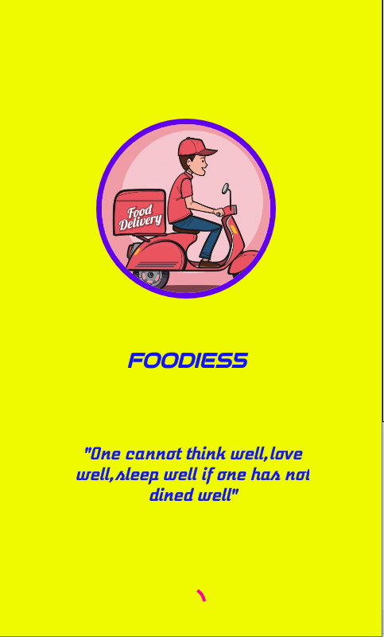
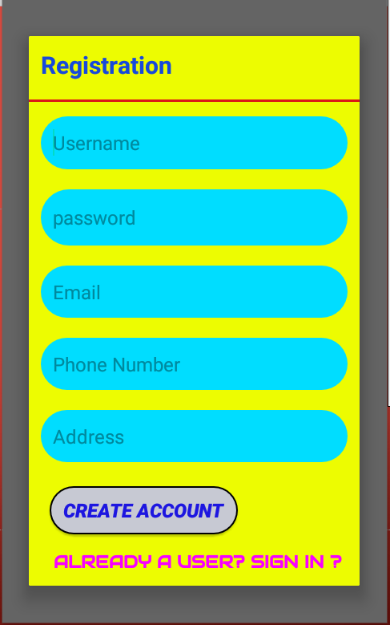
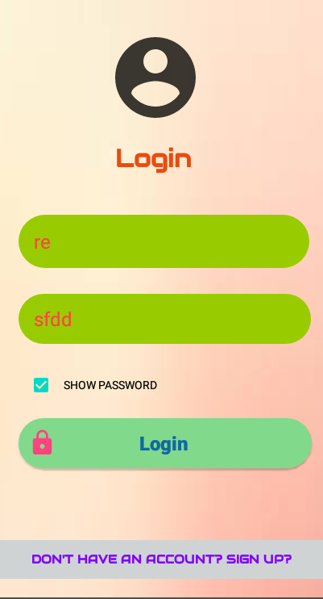
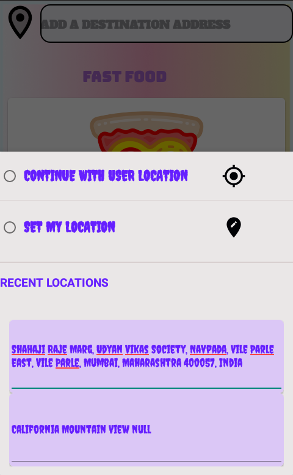
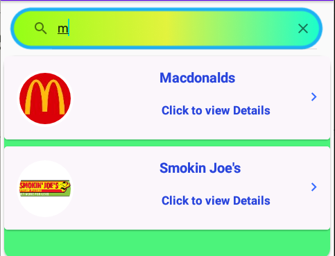
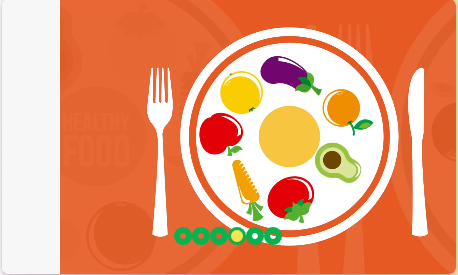
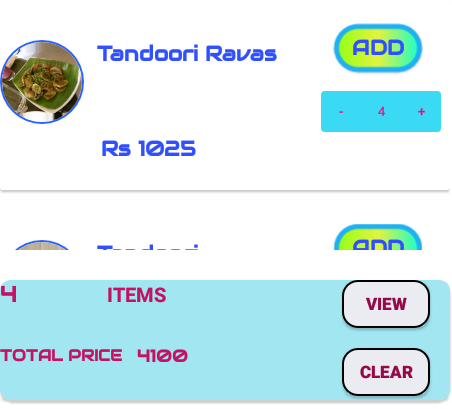
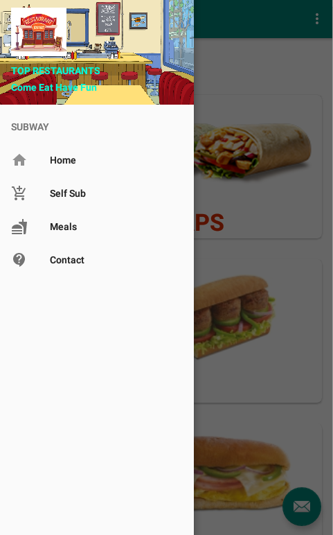
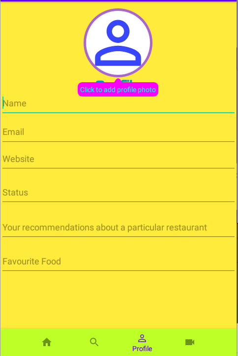

# 🍽️ Food Delivery Application

A full-featured **Android-based food delivery app** built using **Java**, **Firebase**, and **Google Maps APIs**, allowing users to browse restaurants, customize orders, and place food deliveries with real-time location integration.

---

## 📱 Key Features

- 🔐 **Firebase Authentication**
  - Secure user registration and login.
  - User profile management with editable info and profile image.

- 🛒 **Restaurant Discovery & Ordering**
  - View and search nearby restaurants (e.g., McDonald’s, Naturals).
  - Browse menus with customizable food options.
  - Add items using elegant number counters.
  - Place orders with real-time updates from Firebase.

- 🗺️ **Google Maps & Location Integration**
  - Detect and set user location.
  - Display restaurants on the map.
  - Fetch address via marker click using Geocoder API.

- 🎨 **Enhanced UI/UX**
  - Bottom navigation with Home, Search, Profile, and Cuisines.
  - Card views for restaurants and carousel views for cuisines.
  - Splash screen animation and visually rich layout.

---

## 🛠️ Technologies Used

| Category       | Tools / APIs                       |
|----------------|------------------------------------|
| Programming    | Java (Android Studio)              |
| Backend        | Firebase Authentication + Database |
| Maps & Geo     | Google Maps API, Geocoder API      |
| UI Components  | CarouselView, ElegantNumberButton  |

---

## 📸 Screenshots

- Splash screen animation
- 
  
- Registration
- 
  
- Login
- 
  
- Home with GPS and location picker
- 
  
- Search bar with official restaurant links
- 
  
- Carousel views for displaying food categories
- 
  
- Increment/Decrement Item Selection
- 

- Resturant Navigation
- 
  
- Profile setup with status and recommendations
- 

---

## 🧪 Implementation Summary

- Splash screen with animation
- Firebase user authentication and real-time database usage
- Bottom navigation fragments for core modules
- Location setting via Google Maps and address search
- Menu browsing and food item selection
- Restaurant detail linking to official sites
- User profile with editable bio and recommendations
- CarouselView integration for showcasing cuisines

---

## ⚠️ Challenges Faced

- Integrating Firebase RecyclerView adapter and debugging runtime crashes
- Fetching address details via Google Maps markers
- Implementing restaurant search with real-time filtering
- Handling item quantity changes and total price calculations

---

## 🎯 Conclusion

The app provides a streamlined experience for users to discover, customize, and place food orders. It reduces manual effort, saves time, and enhances convenience — especially for busy individuals or during special events.

---

## 🚀 Future Scope

- Integration of machine learning for personalized recommendations
- Showing expected delivery times using real-time traffic data
- UI animation enhancements and modern transitions
- Expanding database to include hotel info, menus, and offers

---

## 🌍 Societal Applications

- Useful for individuals who cannot go out due to work, health, or emergencies.
- Supports catering in parties and gatherings when services aren't available.
- Helps save time by avoiding physical visits to check restaurant availability.

---

## 📄 License

This project was created for academic purposes and is open for learning and collaboration.

---

## 👤 Developed By

**Rishil Vaidya**  
B.Tech Integrated (Computer Engineering)  
Mukesh Patel School of Technology Management and Engineering (NMIMS)

